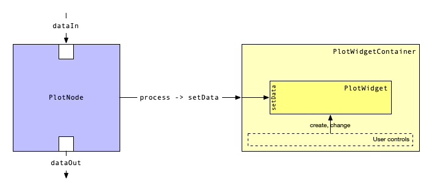

Plotting
========

Plot Nodes
----------
Plots have a somewhat special role in the node system:
We need a node to make plots aware of incoming data, but the node will (typically) not do anything to the data.
In the simplest case, :meth:`Node.process <plottr.node.node.Node.process>` will just call a function that triggers plotting, using the just received data.
For many applications the base class :class:`PlotNode <plottr.plot.base.PlotNode>` will do the job without any need to customize.

Plot Widgets
------------
To make the plot node aware of the presence of a GUI, a suitable widget must be connected to it.
This can be done by instantiating :class:`PlotWidgetContainer <plottr.plot.base.PlotWidgetContainer>`, and passing the instance to the node's :meth:`setPlotWidgetContainer <plottr.plot.base.PlotWidgetContainer.setPlotWidgetContainer>` method.
This will make sure that the container's :meth:`setData <plottr.plot.base.PlotWidgetContainer.setData>` is called whenever the node receives data.
The container can then in turn host a :class:`PlotWidgetContainer <plottr.plot.base.PlotWidget>`, which is connected by using :meth:`setPlotWidget <plottr.plot.base.PlotWidgetContainer.setPlotWidget>`.
The reason why we don't connect the widget directly to the node is that the container may provide controls to change the widgets through user controls.

See the :ref:`API documentation<Base plot API>` for more details.

Automatic plotting with Matplotlib
----------------------------------
The most commonly used plot widget is based on matplotlib: :class:`AutoPlot <plottr.plot.mpl.autoplot.AutoPlot>`.
It determines automatically what an appropriate visualization of the received data is, and then plots that (at least if it can determine a good way to plot).
At the same time it gives the user a little bit of control over the appearance (partially through native matplotlib tools).
To separate plotting from the GUI elements we use :class:`FigureMaker <plottr.plot.mpl.autoplot.FigureMaker>`.

See the :ref:`API documentation<MPL plot API>` for more details.